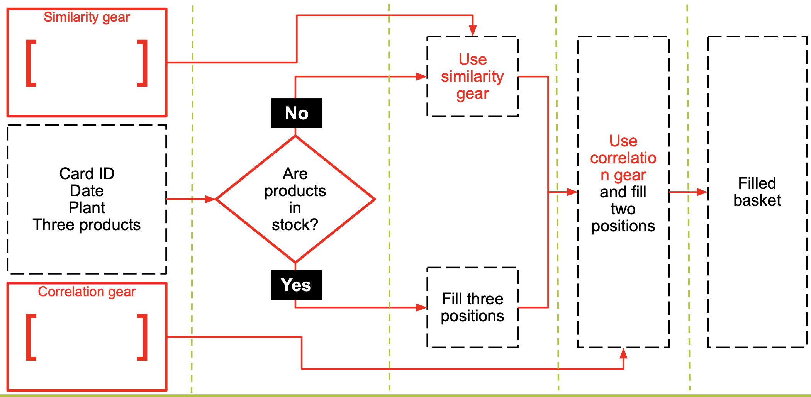

# Lenta Lion -- personal goods assistant

Lenta Lion is the assistant that fully automates goods routine in Lenta. Clients no longer need to spend time, go the stores to select and buy products manually. Lenta Lion automatically proposes the full basket of goods anticipating clients desires (based on Item-Based Collaborative Filtering - the well-known recommender system that is used even in Amazon). Moreover if there is a lack of favourite products, Lenta Lion automatically proposes alternatives and applies the personal discount. More details in the video: **youtube_link**.

## The design of Lenta Lion: 

## Setup

Before launching Lenta Lion make sure that you downloaded the tables into data folder in the repository: [Download the data from Google Drive](https://drive.google.com/file/d/1ad1lk0v1cKAaoMVaVcMvLkmqnw_b5LMC/view?usp=sharing)
